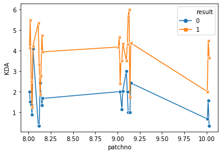
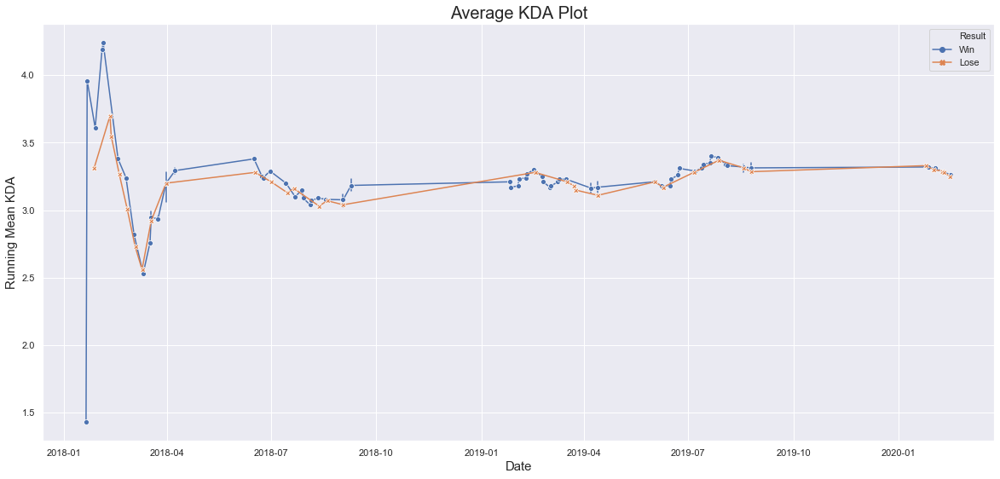

## LCS Player Analysis

### Stats to look into for every player
- This split's VODS:
    - Their positioning tendencies
    - Thier warding patterns
    - Rewatch TL Kay's videos again to see what to get
    - Thier picks
    - Rewatch some analysis videos
    
- Overall    
    - Stats that he provided vs other players (worlds, lcs, etc.)
        - Averages for everything + graphs
        

Kays comment:

```
First thing I would do is create a portfolio of work for a specific team. This can include, but not limited to, build calculations, databases, international regional reports, in depth jungle analysis, scouting reports, etc
```


```python
%matplotlib inline

import pandas as pd
import seaborn as sns
import numpy as np
from datetime import datetime
import matplotlib.pyplot as plt # for data visualization
pd.options.mode.chained_assignment = None  # default='warn'
```


```python
%config IPCompleter.use_jedi = False
```

### Importing data


```python
spring2020 = pd.read_excel('./data/2020/2020-spring-match-data.xlsx')  # February 17

spring2019 = pd.read_excel('./data/2019/2019-spring-match-data.xlsx')
summer2019 = pd.read_excel('./data/2019/2019-summer-match-data.xlsx')
worlds2019 = pd.read_excel('./data/2019/2019-worlds-match-data.xlsx')

spring2018 = pd.read_excel('./data/2018/2018-spring-match-data.xlsx')
summer2018 = pd.read_excel('./data/2018/2018-summer-match-data.xlsx')
worlds2018 = pd.read_excel('./data/2018/2018-worlds-match-data.xlsx')
```


```python
# Aggregate into one giant file
data = spring2020
excel_files = [spring2019, summer2019, worlds2019, spring2018, summer2018, worlds2018]
for e in excel_files:
    data = data.append(e,sort=False)
```


```python
len(data)
```


    62892


```python
### Replace NALCS and EULCS with LCS/LEC
data = data.replace(['NALCS', 'EULCS'], ['LCS', 'LEC'])
```


```python
# Take out Worlds and MSI data
overall = data[~data.league.isin(['WC', 'MSI'])]

# Only include overall for LCS
overall = overall[overall['league'] == 'LCS']
```


```python
def parseDate(excel_date):
    def floatHourToTime(fh):
        h, r = divmod(fh, 1)
        m, r = divmod(r*60, 1)
        return (
            int(h),
            int(m),
            int(r*60),
        )

    dt = datetime.fromordinal(datetime(1900, 1, 1).toordinal() + int(excel_date) - 2)
    hour, minute, second = floatHourToTime(excel_date % 1)
    return dt.replace(hour=hour, minute=minute, second=second).date()
```


```python
overall['date'] = overall['date'].replace(r'^\s*$', np.nan, regex=True)

overall = overall[overall['date'].notna()]

overall['date'] = overall['date'].map(parseDate)
```

### Overall Average Player Stats

The data will exclude worlds and msi data

- Average K,D,A 
    - By Player + Result + Patch + Per Game
    - By Region + Result + Patch
    - By Position + Result + Patch
    - By Champion + Result + Patch


```python
mean_num_games_per_player = int(overall.groupby(['player']).count().gameid.mean())
print(f'Avg Number of games per player {mean_num_games_per_player}')
```

    Avg Number of games per player 55


```python
# Add kda column
overall['KDA'] = (overall['k'] + overall['a']) / overall['d'].replace([0,1])
```


```python
rp = ['result', 'patchno','k','d','a', 'KDA']
player_rp = overall[rp+['player']]
player_rp['patchno'] = player_rp['patchno'].astype(float)
# player_rp['Patch Number'] = player_rp['patchno'].astype(str).str.split('.', expand=True)[0]

# Remove any column with nulls. Turns out 12 are from patchno and 24 are from some ranodm 8.16 games that don't matter too much
player_rp.dropna(inplace=True)

# player_rp['Patch Number'] = player_rp['Patch Number']
```


```python
mean_playrp = player_rp.groupby(['result', 'patchno', 'player']).mean().reset_index()
```


```python
dl = mean_playrp[mean_playrp.player == "Doublelift"]
```


```python
sns.lineplot(x='patchno', y="KDA", data=dl, markers=True, dashes=False, err_style="bars", hue="result", style="result")
```


    <matplotlib.axes._subplots.AxesSubplot at 0x1b53de8ff60>





```python
# History of KDA per match with a line to indicate the career average in these past two years
dl = overall[overall.player=='Doublelift'].sort_values(by='date')
```


```python
def getRunningMeanKDA():
    def getResult(result):
        run_sum = 0
        count = 0
        final_res = []
        for kda, res in zip(dl['KDA'], dl['result']):
            count += 1
            run_sum += float(kda)
            if res == result:
                final_res.append(round(run_sum/count, 2))
            else:
                final_res.append(np.nan)
        return final_res
    r1,r2 = pd.Series(getResult(1)), pd.Series(getResult(0))
    
    return r1.combine_first(r2) 
```


```python
dl.reset_index(inplace=True, drop=True)
```


```python
dl['running_mean_kda'] = getRunningMeanKDA()
dl['Result'] = dl['result'].replace([0,1], ['Lose', 'Win'])
```


```python
plt.figure(figsize = (20,9)) # figure size with ratio 16:9
sns.set(style='darkgrid',) # background darkgrid style of graph 
sns.lineplot(x='date', y="running_mean_kda", data=dl, markers=True, dashes=False, err_style="bars", hue="Result", style="Result")
plt.title("Average KDA Plot", fontsize = 20)
plt.xlabel("Date", fontsize = 15)
plt.ylabel("Running Mean KDA", fontsize = 15)
plt.show()
```





```python
import plotly.express as px

df = px.data.gapminder().query("country=='Canada'")
fig = px.line(df, x="year", y="lifeExp", title='Life expectancy in Canada')
fig.show()
```


    ---------------------------------------------------------------------------
    
    ModuleNotFoundError                       Traceback (most recent call last)
    
    <ipython-input-109-12544f26026c> in <module>
    ----> 1 import plotly.express as px
          2 
          3 df = px.data.gapminder().query("country=='Canada'")
          4 fig = px.line(df, x="year", y="lifeExp", title='Life expectancy in Canada')
          5 fig.show()


    ModuleNotFoundError: No module named 'plotly'


```python

```


```python
def getOverallStats(player_name):
    
```

### Stats that I will look into for every player

- Players avg kda over past two years vs his kda right now as well as his k,d,a separately

### Team Liquid

#### Doublelift


```python
doublelift = overall[overaell.player == 'Doublelift']
```


    ---------------------------------------------------------------------------
    
    NameError                                 Traceback (most recent call last)
    
    <ipython-input-13-2c86b8f2a07d> in <module>()
    ----> 1 doublelift = overall[overaell.player == 'Doublelift']


    NameError: name 'overaell' is not defined


```python
doublelift.league.value_counts()
```


    LCS      62
    NALCS    55
    MSI      31
    WC       12
    Name: league, dtype: int64


```python
doublelift.drop(['gameid', 'league', 'split', 'date',], axis=1, inplace=True)
```


<div>
<style scoped>
    .dataframe tbody tr th:only-of-type {
        vertical-align: middle;
    }

    .dataframe tbody tr th {
        vertical-align: top;
    }
    
    .dataframe thead th {
        text-align: right;
    }
</style>
<table border="1" class="dataframe">
  <thead>
    <tr style="text-align: right;">
      <th></th>
      <th>gameid</th>
      <th>url</th>
      <th>league</th>
      <th>split</th>
      <th>date</th>
      <th>week</th>
      <th>game</th>
      <th>patchno</th>
      <th>playerid</th>
      <th>side</th>
      <th>...</th>
      <th>oppxpat10</th>
      <th>xpdat10</th>
      <th>csat10</th>
      <th>oppcsat10</th>
      <th>csdat10</th>
      <th>csat15</th>
      <th>oppcsat15</th>
      <th>csdat15</th>
      <th>herald</th>
      <th>heraldtime</th>
    </tr>
  </thead>
  <tbody>
    <tr>
      <th>548</th>
      <td>1270555</td>
      <td>http://matchhistory.na.leagueoflegends.com/en/...</td>
      <td>LCS</td>
      <td>2020-1</td>
      <td>43855.7</td>
      <td>1</td>
      <td>1</td>
      <td>10.01</td>
      <td>9</td>
      <td>Red</td>
      <td>...</td>
      <td>3524.0</td>
      <td>-391.0</td>
      <td>86.0</td>
      <td>95.0</td>
      <td>-9.0</td>
      <td>127.0</td>
      <td>140.0</td>
      <td>-13.0</td>
      <td>NaN</td>
      <td>NaN</td>
    </tr>
    <tr>
      <th>735</th>
      <td>1271104</td>
      <td>http://matchhistory.na.leagueoflegends.com/en/...</td>
      <td>LCS</td>
      <td>2020-1</td>
      <td>43857.9</td>
      <td>1</td>
      <td>3</td>
      <td>10.01</td>
      <td>4</td>
      <td>Blue</td>
      <td>...</td>
      <td>2938.0</td>
      <td>-179.0</td>
      <td>81.0</td>
      <td>73.0</td>
      <td>8.0</td>
      <td>135.0</td>
      <td>119.0</td>
      <td>16.0</td>
      <td>NaN</td>
      <td>NaN</td>
    </tr>
    <tr>
      <th>920</th>
      <td>1291426</td>
      <td>http://matchhistory.na.leagueoflegends.com/en/...</td>
      <td>LCS</td>
      <td>2020-1</td>
      <td>43862.7</td>
      <td>2</td>
      <td>1</td>
      <td>10.02</td>
      <td>9</td>
      <td>Red</td>
      <td>...</td>
      <td>3137.0</td>
      <td>-87.0</td>
      <td>87.0</td>
      <td>90.0</td>
      <td>-3.0</td>
      <td>142.0</td>
      <td>126.0</td>
      <td>16.0</td>
      <td>NaN</td>
      <td>NaN</td>
    </tr>
    <tr>
      <th>951</th>
      <td>1291748</td>
      <td>https://matchhistory.na.leagueoflegends.com/en...</td>
      <td>LCS</td>
      <td>2020-1</td>
      <td>43863.6</td>
      <td>2</td>
      <td>2</td>
      <td>10.02</td>
      <td>4</td>
      <td>Blue</td>
      <td>...</td>
      <td>3017.0</td>
      <td>724.0</td>
      <td>94.0</td>
      <td>77.0</td>
      <td>17.0</td>
      <td>145.0</td>
      <td>132.0</td>
      <td>13.0</td>
      <td>NaN</td>
      <td>NaN</td>
    </tr>
    <tr>
      <th>1520</th>
      <td>1304374</td>
      <td>https://matchhistory.na.leagueoflegends.com/en...</td>
      <td>LCS</td>
      <td>2020-1</td>
      <td>43869.7</td>
      <td>3</td>
      <td>1</td>
      <td>10.02</td>
      <td>9</td>
      <td>Red</td>
      <td>...</td>
      <td>3075.0</td>
      <td>599.0</td>
      <td>88.0</td>
      <td>84.0</td>
      <td>4.0</td>
      <td>146.0</td>
      <td>146.0</td>
      <td>0.0</td>
      <td>NaN</td>
      <td>NaN</td>
    </tr>
    <tr>
      <th>1671</th>
      <td>1295383</td>
      <td>https://matchhistory.na.leagueoflegends.com/en...</td>
      <td>LCS</td>
      <td>2020-1</td>
      <td>43871.8</td>
      <td>3</td>
      <td>3</td>
      <td>10.02</td>
      <td>4</td>
      <td>Blue</td>
      <td>...</td>
      <td>3481.0</td>
      <td>-516.0</td>
      <td>73.0</td>
      <td>97.0</td>
      <td>-24.0</td>
      <td>120.0</td>
      <td>149.0</td>
      <td>-29.0</td>
      <td>NaN</td>
      <td>NaN</td>
    </tr>
    <tr>
      <th>2175</th>
      <td>1281254</td>
      <td>https://matchhistory.na.leagueoflegends.com/en...</td>
      <td>LCS</td>
      <td>2020-1</td>
      <td>43876.7</td>
      <td>4</td>
      <td>1</td>
      <td>10.03</td>
      <td>4</td>
      <td>Blue</td>
      <td>...</td>
      <td>3002.0</td>
      <td>417.0</td>
      <td>101.0</td>
      <td>81.0</td>
      <td>20.0</td>
      <td>148.0</td>
      <td>136.0</td>
      <td>12.0</td>
      <td>NaN</td>
      <td>NaN</td>
    </tr>
    <tr>
      <th>2300</th>
      <td>1281549</td>
      <td>http://matchhistory.na.leagueoflegends.com/en/...</td>
      <td>LCS</td>
      <td>2020-1</td>
      <td>43877.7</td>
      <td>4</td>
      <td>2</td>
      <td>10.03</td>
      <td>9</td>
      <td>Red</td>
      <td>...</td>
      <td>3053.0</td>
      <td>195.0</td>
      <td>91.0</td>
      <td>72.0</td>
      <td>19.0</td>
      <td>149.0</td>
      <td>109.0</td>
      <td>40.0</td>
      <td>NaN</td>
      <td>NaN</td>
    </tr>
    <tr>
      <th>1083</th>
      <td>992625</td>
      <td>https://matchhistory.euw.leagueoflegends.com/e...</td>
      <td>LCS</td>
      <td>2019-1</td>
      <td>43491.7</td>
      <td>1</td>
      <td>1</td>
      <td>9.01</td>
      <td>4</td>
      <td>Blue</td>
      <td>...</td>
      <td>3260.0</td>
      <td>413.0</td>
      <td>92.0</td>
      <td>80.0</td>
      <td>12.0</td>
      <td>147.0</td>
      <td>122.0</td>
      <td>25.0</td>
      <td>0.0</td>
      <td>NaN</td>
    </tr>
    <tr>
      <th>1419</th>
      <td>992872</td>
      <td>https://matchhistory.euw.leagueoflegends.com/e...</td>
      <td>LCS</td>
      <td>2019-1</td>
      <td>43492.7</td>
      <td>1</td>
      <td>2</td>
      <td>9.01</td>
      <td>4</td>
      <td>Blue</td>
      <td>...</td>
      <td>3162.0</td>
      <td>163.0</td>
      <td>91.0</td>
      <td>87.0</td>
      <td>4.0</td>
      <td>145.0</td>
      <td>148.0</td>
      <td>-3.0</td>
      <td>1.0</td>
      <td>NaN</td>
    </tr>
    <tr>
      <th>2936</th>
      <td>1061592</td>
      <td>https://matchhistory.euw.leagueoflegends.com/e...</td>
      <td>LCS</td>
      <td>2019-1</td>
      <td>43498.8</td>
      <td>2</td>
      <td>1</td>
      <td>9.02</td>
      <td>9</td>
      <td>Red</td>
      <td>...</td>
      <td>3146.0</td>
      <td>-24.0</td>
      <td>89.0</td>
      <td>73.0</td>
      <td>16.0</td>
      <td>146.0</td>
      <td>117.0</td>
      <td>29.0</td>
      <td>0.0</td>
      <td>NaN</td>
    </tr>
    <tr>
      <th>2991</th>
      <td>1051827</td>
      <td>https://matchhistory.euw.leagueoflegends.com/e...</td>
      <td>LCS</td>
      <td>2019-1</td>
      <td>43499.7</td>
      <td>2</td>
      <td>2</td>
      <td>9.02</td>
      <td>4</td>
      <td>Blue</td>
      <td>...</td>
      <td>2856.0</td>
      <td>416.0</td>
      <td>86.0</td>
      <td>78.0</td>
      <td>8.0</td>
      <td>137.0</td>
      <td>130.0</td>
      <td>7.0</td>
      <td>1.0</td>
      <td>NaN</td>
    </tr>
    <tr>
      <th>3164</th>
      <td>1053221</td>
      <td>https://matchhistory.euw.leagueoflegends.com/e...</td>
      <td>LCS</td>
      <td>2019-1</td>
      <td>43505.8</td>
      <td>3</td>
      <td>1</td>
      <td>9.02</td>
      <td>9</td>
      <td>Red</td>
      <td>...</td>
      <td>2857.0</td>
      <td>410.0</td>
      <td>85.0</td>
      <td>68.0</td>
      <td>17.0</td>
      <td>142.0</td>
      <td>129.0</td>
      <td>13.0</td>
      <td>0.0</td>
      <td>NaN</td>
    </tr>
    <tr>
      <th>3231</th>
      <td>1053417</td>
      <td>https://matchhistory.euw.leagueoflegends.com/e...</td>
      <td>LCS</td>
      <td>2019-1</td>
      <td>43506.7</td>
      <td>3</td>
      <td>2</td>
      <td>9.02</td>
      <td>4</td>
      <td>Blue</td>
      <td>...</td>
      <td>3577.0</td>
      <td>-351.0</td>
      <td>90.0</td>
      <td>93.0</td>
      <td>-3.0</td>
      <td>153.0</td>
      <td>150.0</td>
      <td>3.0</td>
      <td>0.0</td>
      <td>NaN</td>
    </tr>
    <tr>
      <th>3716</th>
      <td>1012155</td>
      <td>https://matchhistory.euw.leagueoflegends.com/e...</td>
      <td>LCS</td>
      <td>2019-1</td>
      <td>43512.7</td>
      <td>4</td>
      <td>1</td>
      <td>9.03</td>
      <td>9</td>
      <td>Red</td>
      <td>...</td>
      <td>3197.0</td>
      <td>94.0</td>
      <td>70.0</td>
      <td>97.0</td>
      <td>-27.0</td>
      <td>134.0</td>
      <td>151.0</td>
      <td>-17.0</td>
      <td>0.0</td>
      <td>NaN</td>
    </tr>
    <tr>
      <th>3783</th>
      <td>1012483</td>
      <td>https://matchhistory.euw.leagueoflegends.com/e...</td>
      <td>LCS</td>
      <td>2019-1</td>
      <td>43513.7</td>
      <td>4</td>
      <td>2</td>
      <td>9.03</td>
      <td>4</td>
      <td>Blue</td>
      <td>...</td>
      <td>3306.0</td>
      <td>272.0</td>
      <td>87.0</td>
      <td>90.0</td>
      <td>-3.0</td>
      <td>145.0</td>
      <td>141.0</td>
      <td>4.0</td>
      <td>0.0</td>
      <td>NaN</td>
    </tr>
    <tr>
      <th>4827</th>
      <td>1014822</td>
      <td>https://matchhistory.euw.leagueoflegends.com/e...</td>
      <td>LCS</td>
      <td>2019-1</td>
      <td>43519.7</td>
      <td>5</td>
      <td>1</td>
      <td>9.03</td>
      <td>4</td>
      <td>Blue</td>
      <td>...</td>
      <td>3262.0</td>
      <td>25.0</td>
      <td>103.0</td>
      <td>97.0</td>
      <td>6.0</td>
      <td>168.0</td>
      <td>155.0</td>
      <td>13.0</td>
      <td>1.0</td>
      <td>NaN</td>
    </tr>
    <tr>
      <th>4923</th>
      <td>1015214</td>
      <td>https://matchhistory.euw.leagueoflegends.com/e...</td>
      <td>LCS</td>
      <td>2019-1</td>
      <td>43520.8</td>
      <td>5</td>
      <td>2</td>
      <td>9.03</td>
      <td>4</td>
      <td>Blue</td>
      <td>...</td>
      <td>3139.0</td>
      <td>404.0</td>
      <td>105.0</td>
      <td>95.0</td>
      <td>10.0</td>
      <td>152.0</td>
      <td>139.0</td>
      <td>13.0</td>
      <td>1.0</td>
      <td>NaN</td>
    </tr>
    <tr>
      <th>5703</th>
      <td>1021654</td>
      <td>https://matchhistory.euw.leagueoflegends.com/e...</td>
      <td>LCS</td>
      <td>2019-1</td>
      <td>43526.9</td>
      <td>6</td>
      <td>1</td>
      <td>9.04</td>
      <td>4</td>
      <td>Blue</td>
      <td>...</td>
      <td>3421.0</td>
      <td>119.0</td>
      <td>97.0</td>
      <td>89.0</td>
      <td>8.0</td>
      <td>154.0</td>
      <td>130.0</td>
      <td>24.0</td>
      <td>1.0</td>
      <td>NaN</td>
    </tr>
    <tr>
      <th>5751</th>
      <td>1031841</td>
      <td>https://matchhistory.euw.leagueoflegends.com/e...</td>
      <td>LCS</td>
      <td>2019-1</td>
      <td>43527.7</td>
      <td>6</td>
      <td>2</td>
      <td>9.04</td>
      <td>4</td>
      <td>Blue</td>
      <td>...</td>
      <td>3333.0</td>
      <td>59.0</td>
      <td>98.0</td>
      <td>91.0</td>
      <td>7.0</td>
      <td>154.0</td>
      <td>145.0</td>
      <td>9.0</td>
      <td>1.0</td>
      <td>NaN</td>
    </tr>
    <tr>
      <th>7095</th>
      <td>1023897</td>
      <td>https://matchhistory.euw.leagueoflegends.com/e...</td>
      <td>LCS</td>
      <td>2019-1</td>
      <td>43533.7</td>
      <td>7</td>
      <td>1</td>
      <td>9.04</td>
      <td>4</td>
      <td>Blue</td>
      <td>...</td>
      <td>3250.0</td>
      <td>59.0</td>
      <td>98.0</td>
      <td>89.0</td>
      <td>9.0</td>
      <td>152.0</td>
      <td>144.0</td>
      <td>8.0</td>
      <td>1.0</td>
      <td>NaN</td>
    </tr>
    <tr>
      <th>7148</th>
      <td>1024218</td>
      <td>https://matchhistory.euw.leagueoflegends.com/e...</td>
      <td>LCS</td>
      <td>2019-1</td>
      <td>43534.6</td>
      <td>7</td>
      <td>2</td>
      <td>9.04</td>
      <td>9</td>
      <td>Red</td>
      <td>...</td>
      <td>3112.0</td>
      <td>271.0</td>
      <td>96.0</td>
      <td>89.0</td>
      <td>7.0</td>
      <td>147.0</td>
      <td>151.0</td>
      <td>-4.0</td>
      <td>1.0</td>
      <td>NaN</td>
    </tr>
    <tr>
      <th>8031</th>
      <td>1071762</td>
      <td>https://matchhistory.euw.leagueoflegends.com/e...</td>
      <td>LCS</td>
      <td>2019-1</td>
      <td>43540.7</td>
      <td>8</td>
      <td>1</td>
      <td>9.05</td>
      <td>4</td>
      <td>Blue</td>
      <td>...</td>
      <td>3326.0</td>
      <td>-417.0</td>
      <td>67.0</td>
      <td>87.0</td>
      <td>-20.0</td>
      <td>124.0</td>
      <td>139.0</td>
      <td>-15.0</td>
      <td>1.0</td>
      <td>NaN</td>
    </tr>
    <tr>
      <th>8619</th>
      <td>1082183</td>
      <td>https://matchhistory.euw.leagueoflegends.com/e...</td>
      <td>LCS</td>
      <td>2019-1</td>
      <td>43541.7</td>
      <td>8</td>
      <td>2</td>
      <td>9.05</td>
      <td>4</td>
      <td>Blue</td>
      <td>...</td>
      <td>3461.0</td>
      <td>-239.0</td>
      <td>93.0</td>
      <td>92.0</td>
      <td>1.0</td>
      <td>137.0</td>
      <td>135.0</td>
      <td>2.0</td>
      <td>1.0</td>
      <td>NaN</td>
    </tr>
    <tr>
      <th>8660</th>
      <td>1074172</td>
      <td>https://matchhistory.euw.leagueoflegends.com/e...</td>
      <td>LCS</td>
      <td>2019-1</td>
      <td>43547.7</td>
      <td>9</td>
      <td>1</td>
      <td>9.05</td>
      <td>9</td>
      <td>Red</td>
      <td>...</td>
      <td>3199.0</td>
      <td>-257.0</td>
      <td>75.0</td>
      <td>94.0</td>
      <td>-19.0</td>
      <td>128.0</td>
      <td>144.0</td>
      <td>-16.0</td>
      <td>0.0</td>
      <td>NaN</td>
    </tr>
    <tr>
      <th>8739</th>
      <td>1074525</td>
      <td>https://matchhistory.euw.leagueoflegends.com/e...</td>
      <td>LCS</td>
      <td>2019-1</td>
      <td>43548.7</td>
      <td>9</td>
      <td>2</td>
      <td>9.05</td>
      <td>4</td>
      <td>Blue</td>
      <td>...</td>
      <td>3067.0</td>
      <td>27.0</td>
      <td>93.0</td>
      <td>87.0</td>
      <td>6.0</td>
      <td>158.0</td>
      <td>138.0</td>
      <td>20.0</td>
      <td>0.0</td>
      <td>NaN</td>
    </tr>
    <tr>
      <th>10947</th>
      <td>1033056</td>
      <td>https://matchhistory.euw.leagueoflegends.com/e...</td>
      <td>LCS</td>
      <td>2019-1P</td>
      <td>43562.6</td>
      <td>SF</td>
      <td>1</td>
      <td>9.06</td>
      <td>4</td>
      <td>Blue</td>
      <td>...</td>
      <td>3225.0</td>
      <td>-69.0</td>
      <td>34.0</td>
      <td>83.0</td>
      <td>-49.0</td>
      <td>82.0</td>
      <td>143.0</td>
      <td>-61.0</td>
      <td>1.0</td>
      <td>NaN</td>
    </tr>
    <tr>
      <th>10959</th>
      <td>1033067</td>
      <td>https://matchhistory.euw.leagueoflegends.com/e...</td>
      <td>LCS</td>
      <td>2019-1P</td>
      <td>43562.6</td>
      <td>SF</td>
      <td>2</td>
      <td>9.06</td>
      <td>4</td>
      <td>Blue</td>
      <td>...</td>
      <td>3426.0</td>
      <td>-21.0</td>
      <td>97.0</td>
      <td>89.0</td>
      <td>8.0</td>
      <td>164.0</td>
      <td>152.0</td>
      <td>12.0</td>
      <td>1.0</td>
      <td>NaN</td>
    </tr>
    <tr>
      <th>10971</th>
      <td>1033073</td>
      <td>https://matchhistory.euw.leagueoflegends.com/e...</td>
      <td>LCS</td>
      <td>2019-1P</td>
      <td>43562.6</td>
      <td>SF</td>
      <td>3</td>
      <td>9.06</td>
      <td>4</td>
      <td>Blue</td>
      <td>...</td>
      <td>3303.0</td>
      <td>119.0</td>
      <td>102.0</td>
      <td>98.0</td>
      <td>4.0</td>
      <td>158.0</td>
      <td>149.0</td>
      <td>9.0</td>
      <td>1.0</td>
      <td>NaN</td>
    </tr>
    <tr>
      <th>11451</th>
      <td>1024049</td>
      <td>https://matchhistory.euw.leagueoflegends.com/e...</td>
      <td>LCS</td>
      <td>2019-1P</td>
      <td>43568.6</td>
      <td>F</td>
      <td>1</td>
      <td>9.06</td>
      <td>4</td>
      <td>Blue</td>
      <td>...</td>
      <td>3287.0</td>
      <td>155.0</td>
      <td>94.0</td>
      <td>100.0</td>
      <td>-6.0</td>
      <td>138.0</td>
      <td>149.0</td>
      <td>-11.0</td>
      <td>1.0</td>
      <td>NaN</td>
    </tr>
    <tr>
      <th>...</th>
      <td>...</td>
      <td>...</td>
      <td>...</td>
      <td>...</td>
      <td>...</td>
      <td>...</td>
      <td>...</td>
      <td>...</td>
      <td>...</td>
      <td>...</td>
      <td>...</td>
      <td>...</td>
      <td>...</td>
      <td>...</td>
      <td>...</td>
      <td>...</td>
      <td>...</td>
      <td>...</td>
      <td>...</td>
      <td>...</td>
      <td>...</td>
    </tr>
    <tr>
      <th>831</th>
      <td>1002620082</td>
      <td>https://matchhistory.na.leagueoflegends.com/en...</td>
      <td>NALCS</td>
      <td>2018-2</td>
      <td>43268.6</td>
      <td>1</td>
      <td>2</td>
      <td>8.11</td>
      <td>4</td>
      <td>Blue</td>
      <td>...</td>
      <td>3515.0</td>
      <td>-9.0</td>
      <td>81.0</td>
      <td>90.0</td>
      <td>-9.0</td>
      <td>145.0</td>
      <td>151.0</td>
      <td>-6.0</td>
      <td>1.0</td>
      <td>NaN</td>
    </tr>
    <tr>
      <th>1904</th>
      <td>1002650020</td>
      <td>https://matchhistory.na.leagueoflegends.com/en...</td>
      <td>NALCS</td>
      <td>2018-2</td>
      <td>43274.6</td>
      <td>2</td>
      <td>1</td>
      <td>8.12</td>
      <td>9</td>
      <td>Red</td>
      <td>...</td>
      <td>3271.0</td>
      <td>-322.0</td>
      <td>83.0</td>
      <td>96.0</td>
      <td>-13.0</td>
      <td>135.0</td>
      <td>142.0</td>
      <td>-7.0</td>
      <td>1.0</td>
      <td>NaN</td>
    </tr>
    <tr>
      <th>2115</th>
      <td>1002650069</td>
      <td>https://matchhistory.na.leagueoflegends.com/en...</td>
      <td>NALCS</td>
      <td>2018-2</td>
      <td>43275.7</td>
      <td>2</td>
      <td>2</td>
      <td>8.12</td>
      <td>4</td>
      <td>Blue</td>
      <td>...</td>
      <td>3594.0</td>
      <td>130.0</td>
      <td>105.0</td>
      <td>91.0</td>
      <td>14.0</td>
      <td>172.0</td>
      <td>150.0</td>
      <td>22.0</td>
      <td>1.0</td>
      <td>NaN</td>
    </tr>
    <tr>
      <th>3855</th>
      <td>1002650117</td>
      <td>https://matchhistory.na.leagueoflegends.com/en...</td>
      <td>NALCS</td>
      <td>2018-2</td>
      <td>43281.7</td>
      <td>3</td>
      <td>1</td>
      <td>8.12</td>
      <td>4</td>
      <td>Blue</td>
      <td>...</td>
      <td>2934.0</td>
      <td>565.0</td>
      <td>90.0</td>
      <td>63.0</td>
      <td>27.0</td>
      <td>138.0</td>
      <td>93.0</td>
      <td>45.0</td>
      <td>1.0</td>
      <td>NaN</td>
    </tr>
    <tr>
      <th>3932</th>
      <td>1002650168</td>
      <td>https://matchhistory.na.leagueoflegends.com/en...</td>
      <td>NALCS</td>
      <td>2018-2</td>
      <td>43282.7</td>
      <td>3</td>
      <td>2</td>
      <td>8.12</td>
      <td>9</td>
      <td>Red</td>
      <td>...</td>
      <td>3236.0</td>
      <td>210.0</td>
      <td>96.0</td>
      <td>89.0</td>
      <td>7.0</td>
      <td>145.0</td>
      <td>147.0</td>
      <td>-2.0</td>
      <td>0.0</td>
      <td>NaN</td>
    </tr>
    <tr>
      <th>5199</th>
      <td>1002670217</td>
      <td>https://matchhistory.na.leagueoflegends.com/en...</td>
      <td>NALCS</td>
      <td>2018-2</td>
      <td>43295.8</td>
      <td>4</td>
      <td>1</td>
      <td>8.13</td>
      <td>4</td>
      <td>Blue</td>
      <td>...</td>
      <td>3233.0</td>
      <td>-57.0</td>
      <td>93.0</td>
      <td>76.0</td>
      <td>17.0</td>
      <td>146.0</td>
      <td>115.0</td>
      <td>31.0</td>
      <td>0.0</td>
      <td>NaN</td>
    </tr>
    <tr>
      <th>5240</th>
      <td>1002670235</td>
      <td>https://matchhistory.na.leagueoflegends.com/en...</td>
      <td>NALCS</td>
      <td>2018-2</td>
      <td>43296.6</td>
      <td>4</td>
      <td>2</td>
      <td>8.13</td>
      <td>9</td>
      <td>Red</td>
      <td>...</td>
      <td>3346.0</td>
      <td>50.0</td>
      <td>88.0</td>
      <td>97.0</td>
      <td>-9.0</td>
      <td>134.0</td>
      <td>150.0</td>
      <td>-16.0</td>
      <td>0.0</td>
      <td>NaN</td>
    </tr>
    <tr>
      <th>6320</th>
      <td>1002660286</td>
      <td>https://matchhistory.na.leagueoflegends.com/en...</td>
      <td>NALCS</td>
      <td>2018-2</td>
      <td>43302.7</td>
      <td>5</td>
      <td>1</td>
      <td>8.13</td>
      <td>9</td>
      <td>Red</td>
      <td>...</td>
      <td>3219.0</td>
      <td>285.0</td>
      <td>100.0</td>
      <td>73.0</td>
      <td>27.0</td>
      <td>147.0</td>
      <td>112.0</td>
      <td>35.0</td>
      <td>0.0</td>
      <td>NaN</td>
    </tr>
    <tr>
      <th>6387</th>
      <td>1002660337</td>
      <td>https://matchhistory.na.leagueoflegends.com/en...</td>
      <td>NALCS</td>
      <td>2018-2</td>
      <td>43303.7</td>
      <td>5</td>
      <td>2</td>
      <td>8.13</td>
      <td>4</td>
      <td>Blue</td>
      <td>...</td>
      <td>3259.0</td>
      <td>-19.0</td>
      <td>90.0</td>
      <td>83.0</td>
      <td>7.0</td>
      <td>154.0</td>
      <td>131.0</td>
      <td>23.0</td>
      <td>0.0</td>
      <td>NaN</td>
    </tr>
    <tr>
      <th>8288</th>
      <td>1002690023</td>
      <td>https://matchhistory.na.leagueoflegends.com/en...</td>
      <td>NALCS</td>
      <td>2018-2</td>
      <td>43309.8</td>
      <td>6</td>
      <td>1</td>
      <td>8.14</td>
      <td>9</td>
      <td>Red</td>
      <td>...</td>
      <td>3445.0</td>
      <td>13.0</td>
      <td>73.0</td>
      <td>82.0</td>
      <td>-9.0</td>
      <td>126.0</td>
      <td>135.0</td>
      <td>-9.0</td>
      <td>1.0</td>
      <td>NaN</td>
    </tr>
    <tr>
      <th>8331</th>
      <td>1002690057</td>
      <td>https://matchhistory.na.leagueoflegends.com/en...</td>
      <td>NALCS</td>
      <td>2018-2</td>
      <td>43310.7</td>
      <td>6</td>
      <td>2</td>
      <td>8.14</td>
      <td>4</td>
      <td>Blue</td>
      <td>...</td>
      <td>3330.0</td>
      <td>156.0</td>
      <td>99.0</td>
      <td>75.0</td>
      <td>24.0</td>
      <td>158.0</td>
      <td>109.0</td>
      <td>49.0</td>
      <td>1.0</td>
      <td>NaN</td>
    </tr>
    <tr>
      <th>10107</th>
      <td>1002680095</td>
      <td>https://matchhistory.na.leagueoflegends.com/en...</td>
      <td>NALCS</td>
      <td>2018-2</td>
      <td>43316.7</td>
      <td>7</td>
      <td>1</td>
      <td>8.14</td>
      <td>4</td>
      <td>Blue</td>
      <td>...</td>
      <td>3026.0</td>
      <td>299.0</td>
      <td>97.0</td>
      <td>88.0</td>
      <td>9.0</td>
      <td>159.0</td>
      <td>139.0</td>
      <td>20.0</td>
      <td>1.0</td>
      <td>NaN</td>
    </tr>
    <tr>
      <th>10167</th>
      <td>1002680137</td>
      <td>https://matchhistory.na.leagueoflegends.com/en...</td>
      <td>NALCS</td>
      <td>2018-2</td>
      <td>43317.6</td>
      <td>7</td>
      <td>2</td>
      <td>8.14</td>
      <td>4</td>
      <td>Blue</td>
      <td>...</td>
      <td>3061.0</td>
      <td>217.0</td>
      <td>95.0</td>
      <td>90.0</td>
      <td>5.0</td>
      <td>142.0</td>
      <td>147.0</td>
      <td>-5.0</td>
      <td>1.0</td>
      <td>NaN</td>
    </tr>
    <tr>
      <th>11564</th>
      <td>1002710038</td>
      <td>https://matchhistory.na.leagueoflegends.com/en...</td>
      <td>NALCS</td>
      <td>2018-2</td>
      <td>43323.8</td>
      <td>8</td>
      <td>1</td>
      <td>8.15</td>
      <td>9</td>
      <td>Red</td>
      <td>...</td>
      <td>3122.0</td>
      <td>69.0</td>
      <td>84.0</td>
      <td>92.0</td>
      <td>-8.0</td>
      <td>141.0</td>
      <td>144.0</td>
      <td>-3.0</td>
      <td>0.0</td>
      <td>NaN</td>
    </tr>
    <tr>
      <th>11619</th>
      <td>1002710079</td>
      <td>https://matchhistory.na.leagueoflegends.com/en...</td>
      <td>NALCS</td>
      <td>2018-2</td>
      <td>43324.7</td>
      <td>8</td>
      <td>2</td>
      <td>8.15</td>
      <td>4</td>
      <td>Blue</td>
      <td>...</td>
      <td>3097.0</td>
      <td>252.0</td>
      <td>101.0</td>
      <td>89.0</td>
      <td>12.0</td>
      <td>157.0</td>
      <td>149.0</td>
      <td>8.0</td>
      <td>0.0</td>
      <td>NaN</td>
    </tr>
    <tr>
      <th>12128</th>
      <td>1002710167</td>
      <td>https://matchhistory.na.leagueoflegends.com/en...</td>
      <td>NALCS</td>
      <td>2018-2</td>
      <td>43330.7</td>
      <td>9</td>
      <td>1</td>
      <td>8.15</td>
      <td>9</td>
      <td>Red</td>
      <td>...</td>
      <td>2999.0</td>
      <td>259.0</td>
      <td>98.0</td>
      <td>92.0</td>
      <td>6.0</td>
      <td>153.0</td>
      <td>134.0</td>
      <td>19.0</td>
      <td>0.0</td>
      <td>NaN</td>
    </tr>
    <tr>
      <th>12236</th>
      <td>1002710243</td>
      <td>https://matchhistory.na.leagueoflegends.com/en...</td>
      <td>NALCS</td>
      <td>2018-2</td>
      <td>43331.7</td>
      <td>9</td>
      <td>2</td>
      <td>8.15</td>
      <td>9</td>
      <td>Red</td>
      <td>...</td>
      <td>2727.0</td>
      <td>816.0</td>
      <td>92.0</td>
      <td>65.0</td>
      <td>27.0</td>
      <td>151.0</td>
      <td>107.0</td>
      <td>44.0</td>
      <td>0.0</td>
      <td>NaN</td>
    </tr>
    <tr>
      <th>14408</th>
      <td>1002720106</td>
      <td>https://matchhistory.na.leagueoflegends.com/en...</td>
      <td>NALCS</td>
      <td>2018-2p</td>
      <td>43345.6</td>
      <td>SF</td>
      <td>1</td>
      <td>8.16</td>
      <td>9</td>
      <td>Red</td>
      <td>...</td>
      <td>2781.0</td>
      <td>951.0</td>
      <td>98.0</td>
      <td>82.0</td>
      <td>16.0</td>
      <td>158.0</td>
      <td>134.0</td>
      <td>24.0</td>
      <td>0.0</td>
      <td>NaN</td>
    </tr>
    <tr>
      <th>14420</th>
      <td>1002720116</td>
      <td>https://matchhistory.na.leagueoflegends.com/en...</td>
      <td>NALCS</td>
      <td>2018-2p</td>
      <td>43345.6</td>
      <td>SF</td>
      <td>2</td>
      <td>8.16</td>
      <td>9</td>
      <td>Red</td>
      <td>...</td>
      <td>3117.0</td>
      <td>289.0</td>
      <td>97.0</td>
      <td>80.0</td>
      <td>17.0</td>
      <td>163.0</td>
      <td>121.0</td>
      <td>42.0</td>
      <td>0.0</td>
      <td>NaN</td>
    </tr>
    <tr>
      <th>14427</th>
      <td>1002720117</td>
      <td>https://matchhistory.na.leagueoflegends.com/en...</td>
      <td>NALCS</td>
      <td>2018-2p</td>
      <td>43345.7</td>
      <td>SF</td>
      <td>3</td>
      <td>8.16</td>
      <td>4</td>
      <td>Blue</td>
      <td>...</td>
      <td>2841.0</td>
      <td>755.0</td>
      <td>94.0</td>
      <td>82.0</td>
      <td>12.0</td>
      <td>158.0</td>
      <td>133.0</td>
      <td>25.0</td>
      <td>1.0</td>
      <td>NaN</td>
    </tr>
    <tr>
      <th>14439</th>
      <td>1002720118</td>
      <td>https://matchhistory.na.leagueoflegends.com/en...</td>
      <td>NALCS</td>
      <td>2018-2p</td>
      <td>43345.7</td>
      <td>SF</td>
      <td>4</td>
      <td>8.16</td>
      <td>4</td>
      <td>Blue</td>
      <td>...</td>
      <td>2883.0</td>
      <td>510.0</td>
      <td>91.0</td>
      <td>73.0</td>
      <td>18.0</td>
      <td>155.0</td>
      <td>122.0</td>
      <td>33.0</td>
      <td>1.0</td>
      <td>NaN</td>
    </tr>
    <tr>
      <th>14919</th>
      <td>1002750055</td>
      <td>https://matchhistory.na.leagueoflegends.com/en...</td>
      <td>NALCS</td>
      <td>2018-2p</td>
      <td>43352.7</td>
      <td>F</td>
      <td>1</td>
      <td>8.16</td>
      <td>4</td>
      <td>Blue</td>
      <td>...</td>
      <td>2831.0</td>
      <td>280.0</td>
      <td>87.0</td>
      <td>75.0</td>
      <td>12.0</td>
      <td>135.0</td>
      <td>133.0</td>
      <td>2.0</td>
      <td>1.0</td>
      <td>NaN</td>
    </tr>
    <tr>
      <th>14931</th>
      <td>1002750058</td>
      <td>https://matchhistory.na.leagueoflegends.com/en...</td>
      <td>NALCS</td>
      <td>2018-2p</td>
      <td>43352.7</td>
      <td>F</td>
      <td>2</td>
      <td>8.16</td>
      <td>4</td>
      <td>Blue</td>
      <td>...</td>
      <td>3877.0</td>
      <td>-784.0</td>
      <td>82.0</td>
      <td>95.0</td>
      <td>-13.0</td>
      <td>133.0</td>
      <td>136.0</td>
      <td>-3.0</td>
      <td>1.0</td>
      <td>NaN</td>
    </tr>
    <tr>
      <th>14943</th>
      <td>1002750060</td>
      <td>https://matchhistory.na.leagueoflegends.com/en...</td>
      <td>NALCS</td>
      <td>2018-2p</td>
      <td>43352.7</td>
      <td>F</td>
      <td>3</td>
      <td>8.16</td>
      <td>4</td>
      <td>Blue</td>
      <td>...</td>
      <td>3560.0</td>
      <td>69.0</td>
      <td>101.0</td>
      <td>88.0</td>
      <td>13.0</td>
      <td>165.0</td>
      <td>148.0</td>
      <td>17.0</td>
      <td>1.0</td>
      <td>NaN</td>
    </tr>
    <tr>
      <th>512</th>
      <td>1002490120</td>
      <td>https://matchhistory.na.leagueoflegends.com/en...</td>
      <td>WC</td>
      <td>2018-W</td>
      <td>43383.1</td>
      <td>G</td>
      <td>1</td>
      <td>8.19</td>
      <td>9</td>
      <td>Red</td>
      <td>...</td>
      <td>3188.0</td>
      <td>103.0</td>
      <td>78.0</td>
      <td>91.0</td>
      <td>-13.0</td>
      <td>135.0</td>
      <td>137.0</td>
      <td>-2.0</td>
      <td>0.0</td>
      <td>NaN</td>
    </tr>
    <tr>
      <th>663</th>
      <td>1002490264</td>
      <td>https://matchhistory.na.leagueoflegends.com/en...</td>
      <td>WC</td>
      <td>2018-W</td>
      <td>43385.1</td>
      <td>G</td>
      <td>3</td>
      <td>8.19</td>
      <td>4</td>
      <td>Blue</td>
      <td>...</td>
      <td>3301.0</td>
      <td>-145.0</td>
      <td>71.0</td>
      <td>89.0</td>
      <td>-18.0</td>
      <td>127.0</td>
      <td>156.0</td>
      <td>-29.0</td>
      <td>NaN</td>
      <td>NaN</td>
    </tr>
    <tr>
      <th>771</th>
      <td>1002490365</td>
      <td>https://matchhistory.na.leagueoflegends.com/en...</td>
      <td>WC</td>
      <td>2018-W</td>
      <td>43386.3</td>
      <td>G</td>
      <td>4</td>
      <td>8.19</td>
      <td>4</td>
      <td>Blue</td>
      <td>...</td>
      <td>3807.0</td>
      <td>-587.0</td>
      <td>98.0</td>
      <td>88.0</td>
      <td>10.0</td>
      <td>153.0</td>
      <td>132.0</td>
      <td>21.0</td>
      <td>1.0</td>
      <td>NaN</td>
    </tr>
    <tr>
      <th>963</th>
      <td>1002490513</td>
      <td>https://matchhistory.na.leagueoflegends.com/en...</td>
      <td>WC</td>
      <td>2018-W</td>
      <td>43389.1</td>
      <td>G</td>
      <td>7</td>
      <td>8.19</td>
      <td>4</td>
      <td>Blue</td>
      <td>...</td>
      <td>3243.0</td>
      <td>-207.0</td>
      <td>84.0</td>
      <td>94.0</td>
      <td>-10.0</td>
      <td>137.0</td>
      <td>146.0</td>
      <td>-9.0</td>
      <td>0.0</td>
      <td>NaN</td>
    </tr>
    <tr>
      <th>992</th>
      <td>1002490532</td>
      <td>https://matchhistory.na.leagueoflegends.com/en...</td>
      <td>WC</td>
      <td>2018-W</td>
      <td>43389.2</td>
      <td>G</td>
      <td>7</td>
      <td>8.19</td>
      <td>9</td>
      <td>Red</td>
      <td>...</td>
      <td>3137.0</td>
      <td>-170.0</td>
      <td>84.0</td>
      <td>86.0</td>
      <td>-2.0</td>
      <td>157.0</td>
      <td>150.0</td>
      <td>7.0</td>
      <td>0.0</td>
      <td>NaN</td>
    </tr>
    <tr>
      <th>1016</th>
      <td>1002490548</td>
      <td>https://matchhistory.na.leagueoflegends.com/en...</td>
      <td>WC</td>
      <td>2018-W</td>
      <td>43389.3</td>
      <td>G</td>
      <td>7</td>
      <td>8.19</td>
      <td>9</td>
      <td>Red</td>
      <td>...</td>
      <td>2917.0</td>
      <td>568.0</td>
      <td>89.0</td>
      <td>78.0</td>
      <td>11.0</td>
      <td>137.0</td>
      <td>131.0</td>
      <td>6.0</td>
      <td>1.0</td>
      <td>NaN</td>
    </tr>
  </tbody>
</table>
<p>160 rows × 100 columns</p>
</div>


```python

```
